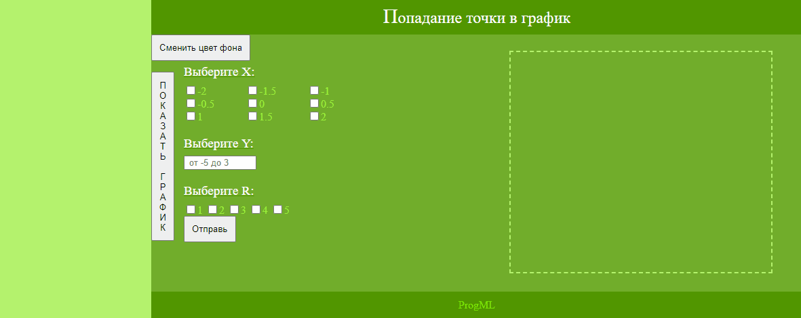
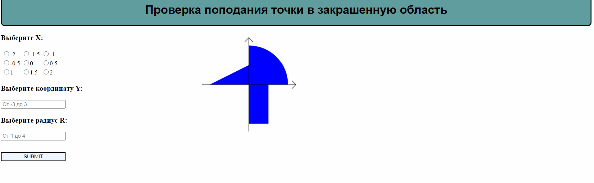

# Dots_and_coordinate_system

## WEB1

Разработать PHP-скрипт, определяющий попадание точки на координатной плоскости в заданную область, и создать HTML-страницу, которая формирует данные для отправки их на обработку этому скрипту.Параметр R и координаты точки должны передаваться скрипту посредством HTTP-запроса. Скрипт должен выполнять валидацию данных и возвращать HTML-страницу с таблицей, содержащей полученные параметры и результат вычислений - факт попадания или непопадания точки в область. Предыдущие результаты должны сохраняться между запросами и отображаться в таблице. Кроме того, ответ должен содержать данные о текущем времени и времени работы скрипта.

## WEB2

Разработать веб-приложение на базе сервлетов и JSP, определяющее попадание точки на координатной плоскости в заданную область.

Разработанная страница JSP должна содержать:

1) Форму, отправляющую данные на сервер.
2) Набор полей для задания координат точки и радиуса области в соответствии с вариантом задания.
3) Сценарий на языке JavaScript, осуществляющий валидацию значений, вводимых пользователем в поля формы.
4) Интерактивный элемент, содержащий изображение области на координатной плоскости (в соответствии с вариантом задания) и реализующий следующую функциональность:
    a) Если радиус области установлен, клик курсором мыши по изображению должен обрабатываться JavaScript-функцией, определяющей координаты точки, по которой кликнул пользователь и отправляющей полученные координаты на сервер для проверки факта попадания.
    б) В противном случае, после клика по картинке должно выводиться сообщение о невозможности определения координат точки.
    в) После проверки факта попадания точки в область изображение должно быть обновлено с учётом результатов этой проверки (т.е., на нём должна появиться новая точка).
5) Таблицу с результатами предыдущих проверок. Список результатов должен браться из контекста приложения, HTTP-сессии или Bean-компонента в зависимости от варианта.

